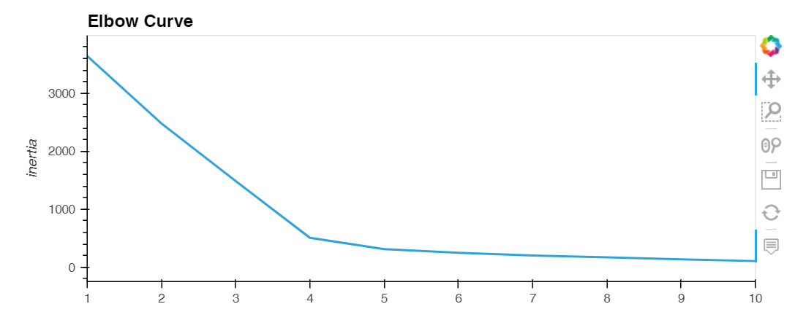
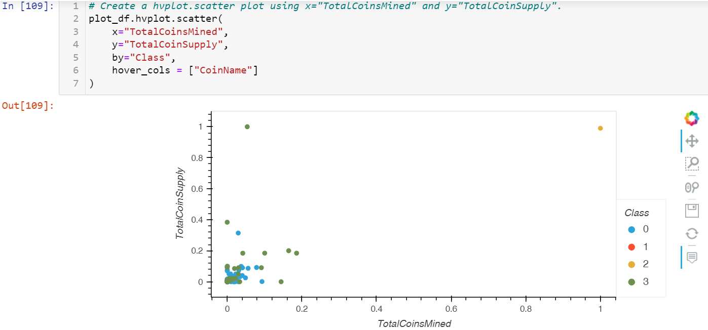

# Cryptocurrencies

## Overview
Accountability Accounting, a prominent investment bank, is interested in offering a new cryptocurrency investment portfolio for its customers. The company, however, is lost in the vast universe of cryptocurrencies. So, they asked us for a report that includes what cryptocurrencies are on the trading market and how they could be grouped to create a classification system for this new investment.

For this report, we used a dataset from the CryptoCompare site, which was not ideal and was necessary a preprocess data to fit the machine learning models. Since there was no known output for what we were looking for, we decided to use unsupervised learning. To group the cryptocurrencies, we decided on a clustering algorithm. Finally, we used data visualizations to share findings. The steps to get the report were:

  1. Preprocessing the database from the CryptoCompare site
  2. Reducing the data dimension using Principal Component Analysis (PCA)
  3. Clustering cryptocurrencies using K-Means
  4. Visualizing classification results with 2D and 3D scatter plots

## Results

**Clustering Cryptocurrencies Using K-means**
1. The following elbow curve graph showcases the K-Means method iterating on k values from 1 to 10

2. The 3D scatter plot showcases the four clusters got from the database

